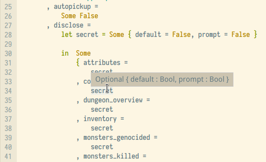
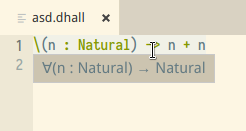

[Dhall]() is an implementation of a _typed lambda calculus_ (i.e. a _functional programming language_; like Haskell, but with substantially different design decisions). Arguably the most useful features one would expect from "editor integration" for a typed language like Dhall is "type-on-hover", that is, when I point the cursor at an _identifier_ (a variable name) I would like a tooltip displaying its type to appear. Like so:



In this article I will talk you through me implementation of "type-on-hover" as part of [dhall-lsp-server](), which together with [vscode-dhall-lsp-server]() provides editor integration for Dhall files in VSCode/[ium](). While Dhall is a specific instance of a typed functional programming language, its relative lack of idiosyncrasies hopefully means that the following should be helpful to someone looking to implement editor support for a different language.

## The Problem, Informally
Suppose we are given an _AST_ ([abstract syntax tree]()) of a Dhall file; in order for the following to make sense, assume the file passes Dhalls typechecker. We are now given a textual "position" inside the file (i.e. a line and column number) and are expected to produce the type of the identifier at that location.

Note that this leaves some room for interpretation regarding what the result should be if the position did not in fact point at an identifier. I believe the way my implementation handles such cases to be quite elegant; stay tuned!

## Dhall's AST
Dhall's AST type `data Expr s a` is defined in [Dhall.Core, lines 10-200](). Having a look at it you might feel overwhelmed by the sheer number of different constructors&mdash;luckily we only really need worry about a small subset:

- __Binders&nbsp;__ The constructors
  - `Lam Text (Expr s a) (Expr s a)` (function abstraction),
  - `Pi Text (Expr s a) (Expr s a)` (function space),
  - and `Let (NonEmpty (Binding s a)) (Expr s a)`

  each _bind_ variable names. We will need to keep track of these bound variables as we traverse the AST in order to be able to ask the typechecker for the types of any subexpressions we might be interested in.

- __Parser annotations&nbsp;__ The precise type of Dhall AST we are dealing with is `Expr Src X`; such an expression may contain "notes" of the form `Note Src (Expr Src X)`. Dhall's parsers uses these notes to mark each node of the AST with the location in the source code it came from. (A `Src` consists of a start and end position, along with the text in between.) We will rely on notes to find out which part of the AST the user pointed at.

- __Imports&nbsp;__ Dhall uses the `Embed` constructor to embed imports into the AST. Since the ASTs we are dealing with had their imports resolved (`a` = `X`, the empty type) this constructor can never appear.

- __Variables&nbsp;__ We wanted to display the types of variables, remember? It turns out to be more convenient to implement "type-on-hover" in such a way that it displays the type of the _smallest subtree_ of the AST containing the cursor position instead, but, if we wanted to, we could restrict this to only consider variables (and not display anything if the position did not point at a `Var` node).

- __Everything else&nbsp;__ When dealing with any of the remaining constructors we only need to consider two cases:
  1. The position lies in one of the subexpressions of the current node of the AST; in this case we recursively look at that subexpression. Through the use of [lenses]() (this is getting exciting, isn't it?) we are able to handle this case generically.
  2. The position does not lie in any of the subexpressions (or we reached a leaf node without any subexpressions); in this case we simply return the type of the current node to the user.

## The implementation (a few lines of Haskell)
The heart of this feature is implemented in [Dhall.LSP.Backend.Typing]() in the function `typeAt'`.
```
typeAt' :: Position -> Context (Expr Src X) -> Expr Src X -> Either (TypeError Src X) (Expr Src X)
````
This function expects a _position_ (a line-column-tuple), a _typechecking context_ representing the binders we passed so far and the current _expression_ (a subexpression of a well-typed `Expr Src X`). The expression is assumed to be free of "multi-lets", i.e. subexpressions of the form `let ... let ... in ...` (these are split into nested lets binding a single variable each in a preprocessing step in `typeAt`). The result of `typeAt'` is either a type error (this should never happen since the input should be well-typed), or the type of the smallest subexpression containing the given position.

Let us look at each of the clauses that make up the definition of `typeAt'` in turn.

- The first clause (lines [35-46]()) concerns the case where the cursor points inside the body of a let expression. For example:
  ```
  let a = 0 in a
               ~
  ```
  In this case, before we can recurse, we need to keep track of the bound variable. Since Dhall allows for "type aliases" like
  ```
  let MaybeNatural = < Nothing : {} | Just : Natural >
  in  MaybeNatural.Just 2 : MaybeNatural
  ```
  we need to handle the case where the bound term is a type separately. Don't look at the details too closely&mdash;they are quite specific to Dhall's semantics.
  ```
  -- Dhall.LSP.Backend.Typing ll. 35-46
  typeAt' pos ctx (Let (Binding x _ a :| []) e@(Note src _)) | pos `inside` src = do
    _A <- typeWithA absurd ctx a
    t <- fmap normalize (typeWithA absurd ctx _A)
    case t of
      Const Type -> do  -- we don't have types depending on values
        let ctx' = fmap (shift 1 (V x 0)) (insert x (normalize _A) ctx)
        _B <- typeAt' pos ctx' e
        return (shift (-1) (V x 0) _B)
      _ -> do  -- but we do have types depending on types
        let a' = shift 1 (V x 0) (normalize a)
        typeAt' pos ctx (shift (-1) (V x 0) (subst (V x 0) a' e))
  ```

- The second clause concerns the case where the cursors points inside the body of a lambda-abstraction, e.g.:
  ```
  \(n : Natural) -> n
                    ~
  ```
  In this case we merely add the type of the bound variable to the typechecking context and recurse.
  ```
  -- Dhall.LSP.Backend.Typing ll. ??
  typeAt' pos ctx (Lam x _A b@(Note src _)) | pos `inside` src = do
  let _A' = Dhall.Core.normalize _A
      ctx' = fmap (shift 1 (V x 0)) (insert x _A' ctx)
  typeAt' pos ctx' b
  ```

- The third clause mirrors the second one for "forall" binders, e.g.:
  ```
  forall (T : Type) -> T
                       ~
  ```

- The next clause is a peculiar one: it peels off a `Note` constructor. This is to make sure that the generic last clause is only ever applied to "meaningful" expressions.
  ```
  typeAt' pos ctx (Note _ expr) = typeAt' pos ctx expr
  ```

- The last clause is where the magic happens:
  ```
  typeAt' pos ctx expr = do
  let subExprs = toListOf subExpressions expr
  case [ (src, e) | (Note src e) <- subExprs, pos `inside` src ] of
    [] -> do type <- typeWithA absurd ctx expr
             return (normalize typ)
    ((src, e):_) -> typeAt' pos ctx (Note src e)
  ```
  `subExprs = toListOf subExpressions expr` gives us the list of all immediate subexpressions of `expr`. This makes use of the lense combinator `toListOf`; `subExpressions` is a "traversal" defined in [Dhall.Core]() with the following type:
  ```
  subExpressions :: Applicative f => (Expr s a -> f (Expr s a)) -> Expr s a -> f (Expr s a)
  ```
  If you find the type of `subExpressions` (and in fact of any of combinators in `Control.Lens`) utterly unenlightening&mdash;you are not alone.

  To digest the rest, first a reminder: if `expr` was produced by [Dhall.Parse]() we know that every subexpression is wrapped in a `Note` constructor telling us which part of the source code it came from. This means that the case expression considers the following two cases:
  - Either `pos` is not contained in any of the subexpressions of `expr`; return the type of `expr`.
  - Otherwise recurse with the corresponding subexpression.

The last clause causes the following behaviour:



Rather neat, eh?
